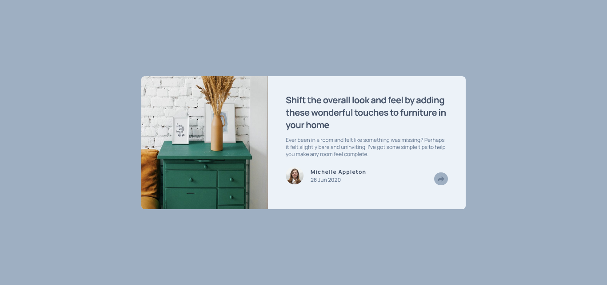

# Frontend Mentor - Article preview component solution

This is a solution to the [Article preview component challenge on Frontend Mentor](https://www.frontendmentor.io/challenges/article-preview-component-dYBN_pYFT). Frontend Mentor challenges help you improve your coding skills by building realistic projects. 

## Table of contents

- [Overview](#overview)
  - [The challenge](#the-challenge)
  - [Screenshot](#screenshot)
  - [Links](#links)
- [My process](#my-process)
  - [Built with](#built-with)
  - [What I learned](#what-i-learned)
  - [Continued development](#continued-development)
  - [Useful resources](#useful-resources)
- [Author](#author)
- [Acknowledgments](#acknowledgments)


## Overview

### The challenge

JS Challenge 

### Screenshot




### Links

- Solution URL: [https://github.com/asad102/article-preview](https://github.com/asad102/article-preview)
- Live Site URL: [https://asad102.github.io/article-preview/](https://asad102.github.io/article-preview/)

## My process

### Built with

- Semantic HTML5 markup
- CSS custom properties
- Flexbox
- CSS Grid
- Mobile-first workflow
-  [Tailwindcss](https://tailwindcss.com/) - CSS Framework


### What I learned

How HTML & JS Integrate to Each Other

```html
            <button class="bg-blue-Grayish  p-2 rounded-full" id="share-btn"></button>
            <div class="share absolute -md:mt-20 md:w-52 w-full gap-2 bottom-0 left-0 md:bottom-24 md:left-56 ">
              <ul id="share-icon" class="hidden  bg-blue-VeryDarkGrayish px-3 py-2 md:rounded-lg rounded-none ">
                <p class="text-blue-DesaturatedDark mr-4">SHARE</p>
                <li class="link mr-4"><a href="https://www.facebook.com/abdirah1m" target="_blank"></a></li>
                <li class="link mr-4"><a href="https://x.com/abdirahimali" target="_blank"></a></li>
                <li class="link mr-4"><a href="https://www.facebook.com/abdirah1m" target="_blank"></a></li>
              </ul>                   
            </div>

```

```js
document.getElementById("share-btn").addEventListener("click", function () {
    // alert('your are right');
    let shareIcons = document.getElementById("share-icon");
    if(shareIcons.classList.contains("hidden")) {
        shareIcons.classList.remove("hidden");
        shareIcons.classList.add("flex");
    } else {
        shareIcons.classList.add("hidden");
    }
});
}
```

If you want more help with writing markdown, we'd recommend checking out [The Markdown Guide](https://www.markdownguide.org/) to learn more.

**Note: Delete this note and the content within this section and replace with your own learnings.**

### Continued development

JS, React & NextJS

### Useful resources

Chatgpt

## Author

- Website - [Abdirahim Ali](https://www.abdirahimali.com)
- Frontend Mentor - [@asad102](https://www.frontendmentor.io/profile/asad102)
- Twitter - [@abdirahimali](https://x.com/abdirahimali)

## Acknowledgments

Thanks frontend mentor for the challenges

